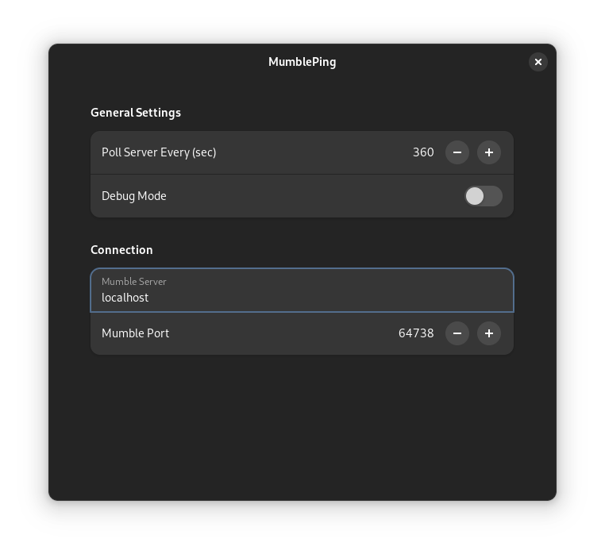

# gnome-shell-extension-mumble-ping

<p align="center">
 
</p>

<div align="center">


[](https://github.com/maweil/gnome-shell-extension-mumble-ping/issues)
[](https://github.com/maweil/gnome-shell-extension-mumble-ping/pulls)
[](/LICENSE)

</div>

---

<p align="center">
Gnome Shell Extension to see how many people are online on your mumble server of choice.

</p>

## 📝 Table of Contents

- [gnome-shell-extension-mumble-ping](#gnome-shell-extension-mumble-ping)
  - [📝 Table of Contents](#-table-of-contents)
  - [🧐 About <a name ="about"></a>](#-about-)
  - [🏁 Getting Started](#-getting-started)
  - [🔧 Testing the extension](#-testing-the-extension)
  - [🎈 Usage <a name="usage"></a>](#-usage-)
  - [🎉 Acknowledgements <a name = "acknowledgement"></a>](#-acknowledgements-)
  - [Licensing](#licensing)
  
## 🧐 About <a name ="about"></a>

This extensions adds an indicator to your gnome shell to see how many users
are currently online on a specified
[mumble](https://github.com/mumble-voip/mumble) server.
This should work for all servers that have the `allowping` setting set to `true`
in their configuration (which is the default).
You can configure which server/port to ping and how often this should be done.

## 🏁 Getting Started

### Prerequisites

This extension requires one of the following Gnome Shell versions:

- 3.38
- 40
- 41
- 42
- 43
- 44

### Installation

It's recommended to install this extension
through [extensions.gnome.org](https://extensions.gnome.org/extension/4341/mumbleping/).
You can visit this extensions install page using the button below.

<p align="center">
<a href="https://extensions.gnome.org/extension/4341/mumbleping/">
  </a>
</p>

#### Installation from source

```bash
git clone https://github.com/maweil/gnome-shell-extension-mumble-ping.git
cd gnome-shell-extension-mumble-ping
./scripts/deploy.sh
```

After performing these steps, it is necessary to restart your GNOME Shell
(or log out and log in again).

You can then enable the extension using either GNOME's Extension app
or using the following command:

```bash
gnome-extensions enable mumble-ping@maweil.github.com 
```

## 🔧 Testing the extension

If you want to try out this extension without reloading your GNOME Shell,
you can try it in a nested session.
First, make sure the latest version is installed and enabled
if you have done some changes:

```bash
./scripts/deploy.sh
gnome-extensions enable mumble-ping@maweil.github.com
```

Then start a nested gnome shell session:

### Using Wayland

```bash
# Start a nested gnome shell
dbus-run-session -- gnome-shell --nested --wayland
```

### Using X

```bash
# Start a nested gnome shell
dbus-run-session -- gnome-shell --nested
```

## 🎈 Usage <a name="usage"></a>

By default, this extension tries to ping a mumble server on your local machine
and the default port. You can change this in the extension settings
(see screenshot below).



## 🎉 Acknowledgements <a name = "acknowledgement"></a>

- A big thanks to the [Papirus Development Team](https://github.com/PapirusDevelopmentTeam)
for designing the
[Mumble icon](https://github.com/PapirusDevelopmentTeam/papirus-icon-theme/blob/77fad87146ce97ca76fa54379a6fe16545146ab4/Papirus/64x64/apps/mumble.svg)
that was used (with small modifications) for this extension

## Licensing

This project is licensed under the terms specified in [LICENSE](LICENSE).

The folder `icons` contains versions of the mumble icon originally designed by
[PapirusDevelopmentTeam](https://github.com/PapirusDevelopmentTeam/)
under the terms of the GPLv3.
For the use in this extension, colors and size of the icon was modified.
